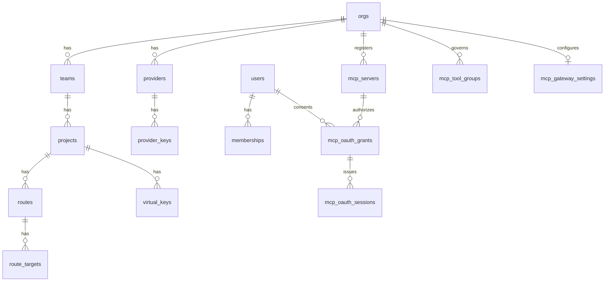

# Data model

PostgreSQL is the source of truth. The initial schema lives in [`migrations/0001_init.sql`](../../migrations/0001_init.sql); ClickHouse log schema in [`clickhouse/001_logs.sql`](../../clickhouse/001_logs.sql).

## Tenancy



- **Org → Team → Project → Virtual Key** is the hierarchy. Budgets and rate limits attach at any scope and combine **most-restrictive-wins**.
- **Providers** are owned at the org level and referenced by route targets. Upstream credentials live in `provider_keys`, **envelope-encrypted** (see [security.md](security.md)).
- **Routes** belong to a project and map a public `model` to `route_targets` with a `strategy`.
- **Virtual keys** belong to a project, store only a hash of the key plus a display prefix, and carry an optional model allow-list.
- **MCP servers** belong to an org and declare required OAuth scopes and exposed tool names. Only enabled servers reach gateway snapshots. Grants bind a user to a server; sealed token sessions belong to a grant. **MCP tool groups** persist named server/tool manifests, while **MCP gateway settings** hold organization defaults for registration and MCP-aware clients; neither is currently a request-path authorization boundary.

## Cost & limits

- `model_prices` — USD per million tokens for input/output (+ cached input). Used to compute `cost_usd` per request, written to ClickHouse.
- `budgets` — spend caps per scope and period; enforced before forwarding and refreshed from spend aggregates.
- `rate_limits` — RPM/TPM per scope; counters live in Redis for multi-instance correctness.

## Config versioning

`config_version` holds a single monotonic counter the gateways watch for reload-free updates ([config-and-hot-reload.md](config-and-hot-reload.md)). `audit_log` records who changed what.

The RBAC tables are split on exactly this question. `access_profile_policies`, `access_profile_assignments`, `access_profiles` and `memberships` all carry a `bump_config_version()` trigger, because the gateway resolves the model/route policy of each virtual key's owner from them and enforces it on the request path (#791, [ADR-0023](../adr/2026-08-04-access-policy-propagation.md)). `custom_roles` and `custom_role_grants` do not and must not: they decide control-plane authorization, which is evaluated live per request, so a bump would wake the fleet for a change it cannot observe.

`plugin_instances` is the control-plane registry for desired request/response middleware configuration. A row belongs to an org and may narrow to a project; slugs are unique within that scope. Endpoint credentials are environment-variable references and `config` is always a JSON object. The table deliberately has no `bump_config_version()` trigger until the allocation-light gateway dispatcher in #509 consumes it—an enabled registry row is configuration, not a false claim that middleware is running.

The guardrail registry is deployment-wide:

- `guardrail_rules` stores the ordered built-in and bounded-regex policy managed by the dashboard. Exactly one of `builtin` or `pattern` is present on every row.
- `guardrail_providers` stores external webhook endpoints and environment-variable credential references. A partial unique index permits at most one enabled provider because the gateway exposes one vendor-neutral webhook contract.

Both tables bump `config_version` in the write transaction. File-owned rules remain immutable and win name collisions; database rules extend that policy. An enabled file-owned webhook remains authoritative, otherwise the active registry provider supplies the snapshot webhook.

Several deployment-wide settings are stored as **singleton tables**: one row keyed by `id boolean primary key default true check (id)`, seeded by their own migration, so a read never has to handle "not configured yet". `runtime_policy`, `compatibility_policy`, `security_settings`, `logging_settings`, `client_settings` and `model_defaults` all follow this shape and all bump `config_version` in the write transaction.

Two of them landed with the Settings screens (#564):

- `client_settings` — the base URL the dashboard advertises (advisory; the gateway never reads it), the allowlist of inbound client headers forwarded to the upstream provider, the static headers the gateway injects on every upstream request, and the request-id header. Trace-context headers propagate independently of the allowlist, and injected header values are treated as credential material: they reach the gateway through the snapshot but never the audit log, which records only the names.
- `model_defaults` — an `enabled` kill switch plus optional `default_model`, `default_temperature`, `default_top_p` and `default_max_tokens`. Defaults only ever fill a key the request omitted, so the table can be populated without changing the meaning of any request that was already explicit. `default_temperature` and `default_top_p` are `double precision`, not `real`: an `f32` default serializes into JSON as `0.800000011920929` and that is what would reach the provider.

## Data written *by* the data plane

Most tables flow control plane → gateway. Two flow the other way, written from the channel the gateway already holds and never read back by it:

- `cluster_nodes` — one row per node, upserted from the snapshot poll (#543).
- `adaptive_routing_telemetry` — one row per `(node, model)` holding the newest adaptive-routing sample that node pushed (#751): the decision split, the sanitized policy it runs, and a JSON document of per-target scores and signals. A scoreboard, not history — every report overwrites the row, so the table is the size of the fleet rather than of the traffic.

Neither carries a `bump_config_version()` trigger, and neither may grow one: the data plane does not consume them, and a version bump on every heartbeat or sample would make routine bookkeeping look like a config change and wake the whole fleet.

## Migrations are append-only

Migrations are embedded with `sqlx::migrate!` and sqlx stores a checksum of every
migration it applies. If a shipped file's bytes change — even a stripped trailing
newline, as a formatting hook once did in #710 — every database that already ran it
refuses to start on its next upgrade:

```
Error: store error: migration 18 was previously applied but has been modified
```

CI databases always start empty, so nothing else catches this: the change merges
green and breaks deployments later. Never edit, delete or rename a file under
`crates/rolter-store/migrations/`; add a new `NNNN_*.sql` instead. Numbers are
append-only and never reused, even where the sequence has a gap.

`scripts/check-migrations-immutable.sh` enforces this. It runs as the
`migrations append-only` job in `quality.yml` (inside the `ci-ok` gate) and as a
`prek` hook locally, rejecting any modified, deleted or renamed migration relative
to the branch's fork point from `master`.

## Mapping to the gateway

The control plane composes the normalized tables into the same shape as `rolter_core::GatewayConfig` (providers, routes, virtual keys and authorized MCP sessions), which the gateway turns into an immutable `Snapshot`.
