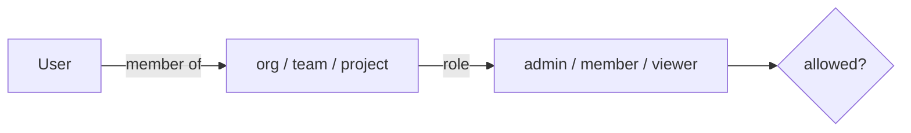

# RBAC & authentication

Two distinct auth surfaces:

## 1. Gateway (data plane) — virtual keys

Clients call `/v1/*` with a **virtual key** (`Authorization: Bearer <key>` or `x-api-key`). The gateway:

- looks the key up in the current snapshot
- checks the key's model allow-list (empty = all)
- (roadmap) enforces budgets and RPM/TPM limits for the key's scope chain

Keys are stored as hashes; the presented key is compared in constant time (`rolter_auth::verify_key`).

### Empty key sets

An empty effective key set does **not** mean "auth disabled" on a managed
deployment. A gateway started with `--snapshot-url` (its config comes from the
control plane) **fails closed**: with no virtual keys in the snapshot every
`/v1/*` request gets `401`. This keeps revoking the last key a lock-down rather
than an accidental opening of the whole data plane.

A gateway running from a static bootstrap config with no keys stays keyless, so
local `fake-llm` development needs no setup.

Override either default with `server.require_auth`:

| value | behaviour on an empty key set |
| --- | --- |
| `true` | always deny (`401`) |
| `false` | always allow the keyless path |
| unset (default) | managed → deny, static local config → allow |

## 2. Control plane (dashboard) — users + roles

Human users authenticate to the control plane. v1 ships **local accounts** (argon2id password hashes). RBAC roles:

- **admin** — full control within scope (manage providers, routes, keys, members, budgets)
- **member** — create/edit routes and keys within scope
- **viewer** — read-only (dashboards, logs)

Roles are granted via `memberships` at an **org / team / project** scope. Permission checks resolve the most specific membership for the target resource.

## Roadmap

- **OAuth2 / OIDC SSO** — pluggable `IdentityProvider`; map IdP groups → roles.
- **LDAP** — bind + group mapping for enterprise directories.
- **JWT** service auth and short-lived tokens.
- **Audit log** surfaced in the UI.
- Optional **constant-time map** / pepper for virtual-key lookup hardening.
