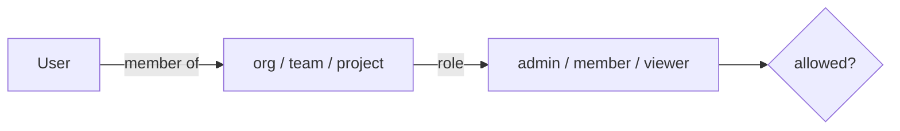
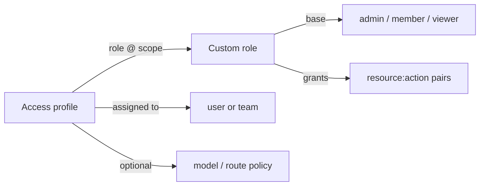

# RBAC & authentication

Two distinct auth surfaces:

## 1. Gateway (data plane) — virtual keys

Clients call `/v1/*` with a **virtual key** (`Authorization: Bearer <key>` or `x-api-key`). The gateway:

- looks the key up in the current snapshot
- checks the key's model allow-list (empty = all)
- (roadmap) enforces budgets and RPM/TPM limits for the key's scope chain

Keys are stored as hashes; the presented key is compared in constant time (`rolter_auth::verify_key`).

### Empty key sets

An empty effective key set does **not** mean "auth disabled" on a managed
deployment. A gateway started with `--snapshot-url` (its config comes from the
control plane) **fails closed**: with no virtual keys in the snapshot every
`/v1/*` request gets `401`. This keeps revoking the last key a lock-down rather
than an accidental opening of the whole data plane.

A gateway running from a static bootstrap config with no keys stays keyless, so
local `fake-llm` development needs no setup.

Override either default with `server.require_auth`:

| value | behaviour on an empty key set |
| --- | --- |
| `true` | always deny (`401`) |
| `false` | always allow the keyless path |
| unset (default) | managed → deny, static local config → allow |

## 2. Control plane (dashboard) — users + roles

Human users authenticate to the control plane. v1 ships **local accounts** (argon2id password hashes). RBAC roles:

- **admin** — full control within scope (manage providers, routes, keys, members, budgets)
- **member** — create/edit routes and keys within scope
- **viewer** — read-only (dashboards, logs)

Roles are granted via `memberships` at an **org / team / project** scope. Permission checks resolve the most specific membership for the target resource.



### The capability table is the only source of truth

`CAPABILITIES` in `crates/rolter-control/src/rbac_matrix.rs` records, for every resource, what each of `read` / `create` / `update` / `delete` takes — a minimum scoped role, superadmin-only, or that the resource has no such action at all. **Both** the published matrix and the guard read it, so they cannot drift.

A guarded handler names a `(resource, action)` pair instead of a role:

```rust
authorize(&state, &principal, ScopeChain::org(org_id), cap!("provider", Create)).await?;
// deployment-wide, no scope to hold a role in:
authorize_superadmin(&principal, superadmin_cap!("feature_flags", Update))?;
```

`cap!` resolves the requirement through a `const fn`, so naming a resource the table does not define — or an action it marks as unsupported — is a **compile error**, and `superadmin_cap!` additionally fails to compile unless the table says the pair is superadmin-only. No handler names a `Role`; unit tests in `rbac_matrix.rs` scan every control-plane module to keep it that way, check the module list against `src/` so a new file cannot slip past, and assert that every row in the table is claimed by at least one guard.

Two read-only endpoints publish that table, so a dashboard never assembles a permission matrix of its own:

- `GET /api/v1/rbac/matrix` — every role and, per resource, the minimum role each action takes (or that the action is superadmin-only, or unsupported entirely). Any authenticated caller may read it; it describes rules, not anyone's access.
- `GET /api/v1/rbac/effective?org_id=&team_id=&project_id=` — the calling principal's resolved role at that scope chain and the concrete `resource:action` pairs they may perform, evaluated from their memberships.

`effective` is advisory to the client and authoritative only on the server: a caller that ignores it and issues the request anyway gets the same `403`. Scope precedence is unchanged — a project-scoped grant authorizes that project, not the whole org.

Read access is a viewer's and mutations are an admin's, with three deliberate exceptions:

- **deployment-wide policy** (feature flags, runtime/compatibility/adaptive policy, logging settings, cluster nodes, security settings, alerting, MCP tool-call logs) has no tenancy scope to be a member of, so it is superadmin-only;
- **global account lifecycle** — creating an org, editing or deleting a user account, and the model/pricing catalog — reaches across orgs, so it is superadmin-only too, while inviting a user *into* an org stays an org admin's;
- **a user's own things** — minting a virtual key for yourself takes `member` (a viewer cannot), and revoking your own MCP OAuth grant or session takes only a viewer membership plus ownership, which the handler checks after the guard.

Listing the pricing catalog (`GET /api/v1/model-prices`) and the effective model list (`GET /api/v1/models`) are not guarded at all today: any authenticated principal may read them. The table records `viewer` as the nominal floor for those reads; tightening them is tracked in #766.

### Custom roles and access profiles

The three built-in roles are a floor, not the whole rule set. An org may define **custom roles**: a base role plus a set of explicit `(resource, action)` grants drawn from the same `CAPABILITIES` table the guard reads. A grant can only *widen* — a custom role never takes away what its base role already allows, so the built-in roles keep behaving exactly as before and nothing has to be migrated.

Custom roles are not assigned to people directly. They are composed into an **access profile**, which names each role together with the org, team or project it applies at, and the profile is then assigned to users or teams. One profile can therefore say "auditor at the org, deploy admin on this one project" and be reused across an organization instead of re-granted per person.



Evaluation order inside `authorize` is unchanged for the common case: memberships resolve first, and the configurable half is consulted only if the built-in answer was "no". That keeps a plain deployment on exactly the old code path, and makes a custom grant strictly additive.

A profile may also carry a **model and route policy** — allow and deny lists over the models and routes its holders may reach. Deny wins over allow. Where a user holds several profiles the lists are unioned rather than intersected, since a second profile must never *reduce* access; one consequence is load-bearing: a profile with no model restriction at all makes the merged allow-list unrestricted, because that profile already permitted everything on its own.

That policy is published on `GET /api/v1/rbac/effective` as `model_policy` and is **not yet enforced by the data plane**. None of these tables carries a `bump_config_version()` trigger and none may grow one: control-plane authorization is evaluated per request against the live database, so there is nothing to propagate through `/internal/snapshot`, and bumping the version on every role edit would wake the whole gateway fleet for a change it cannot observe. Carrying the resolved policy to the gateway needs a different mechanism and is tracked separately.

Changing one is safe by construction:

- deleting a custom role that a profile still references returns `409` rather than silently emptying the profile's composition; detach it first;
- deleting a profile does cascade its own assignments, since the assignment has no meaning without it;
- every create, update and delete on a role, a profile, an assignment or a policy is written to `audit_log` with the before/after, because all of them change what real people can do.

`GET /api/v1/rbac/matrix?org_id=` returns the org's custom roles alongside the built-in ones, so the dashboard's matrix is API-backed and updates after any change instead of holding state of its own.

Endpoints:

- `GET`/`POST /api/v1/orgs/{org_id}/custom-roles`, `GET`/`PUT`/`DELETE /api/v1/custom-roles/{id}`
- `GET`/`POST /api/v1/orgs/{org_id}/access-profiles`, `GET`/`PUT`/`DELETE /api/v1/access-profiles/{id}`
- `GET`/`POST /api/v1/access-profiles/{id}/assignments`, `DELETE /api/v1/access-profile-assignments/{id}`
- `PUT /api/v1/access-profiles/{id}/policy`

## Roadmap

- **OAuth2 / OIDC SSO** — pluggable `IdentityProvider`; map IdP groups → roles.
- **LDAP** — bind + group mapping for enterprise directories.
- **JWT** service auth and short-lived tokens.
- **Audit log** surfaced in the UI.
- Optional **constant-time map** / pepper for virtual-key lookup hardening.
